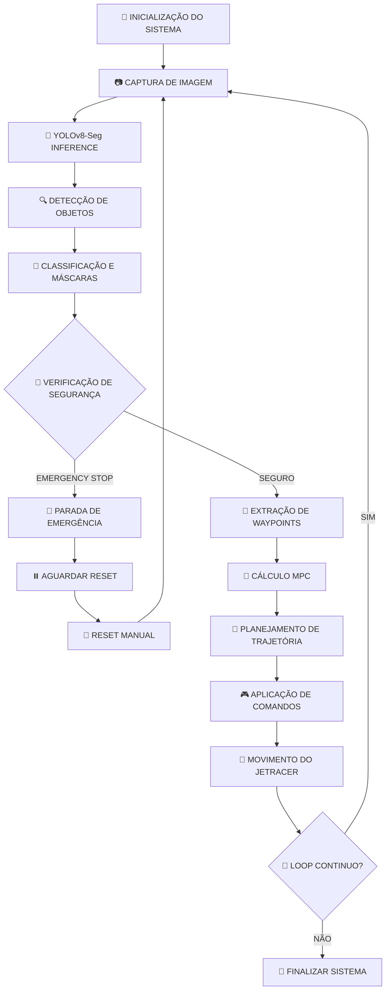
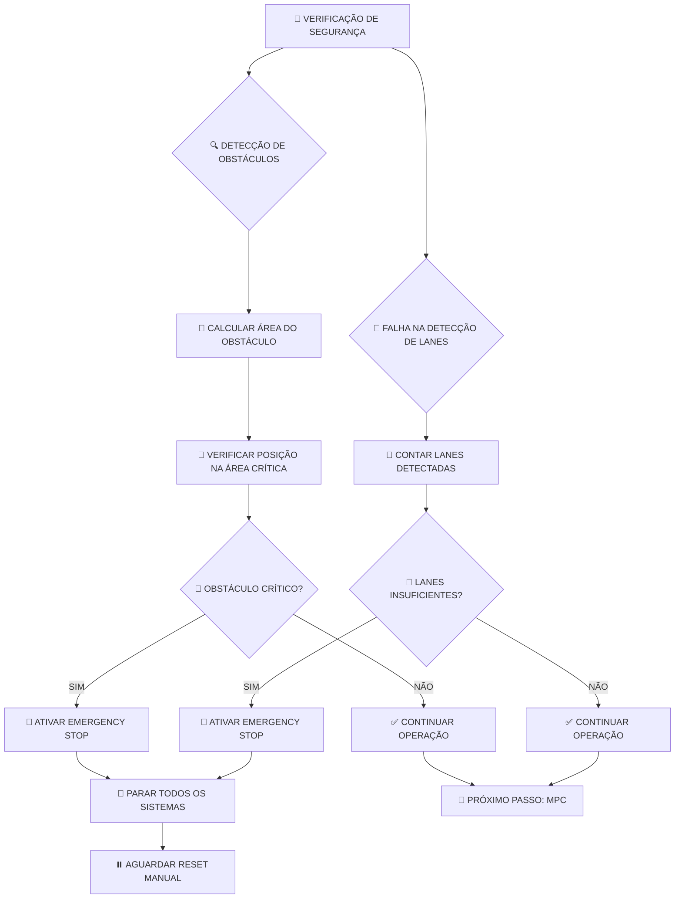
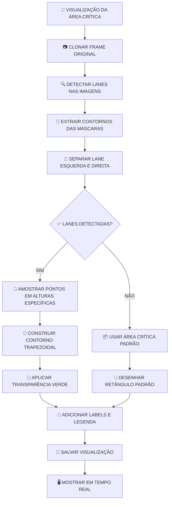
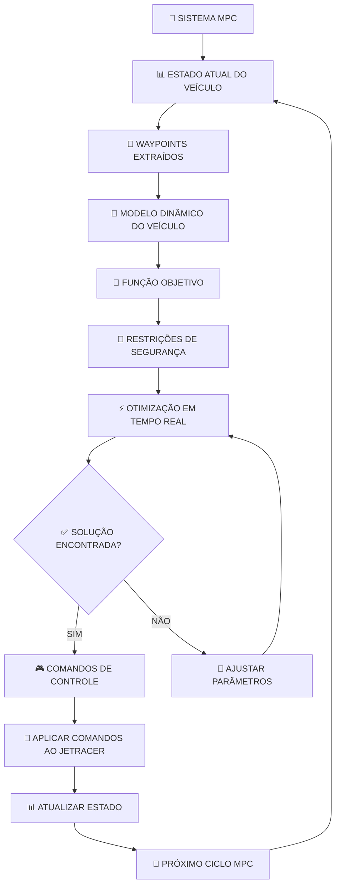
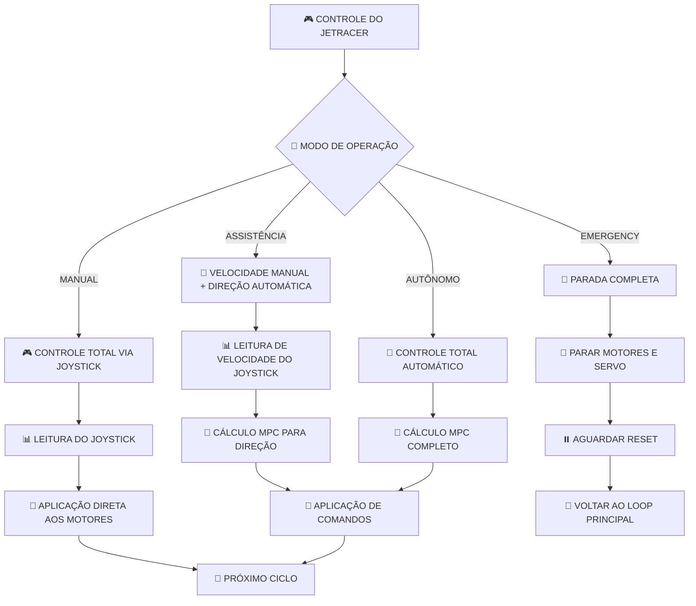
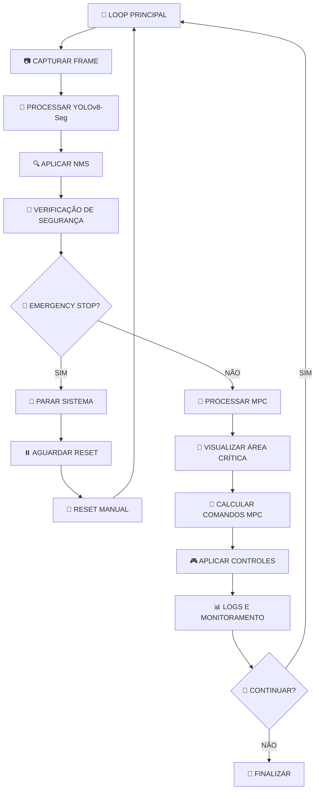
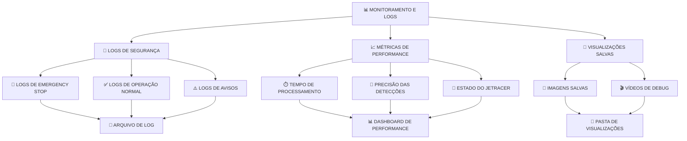
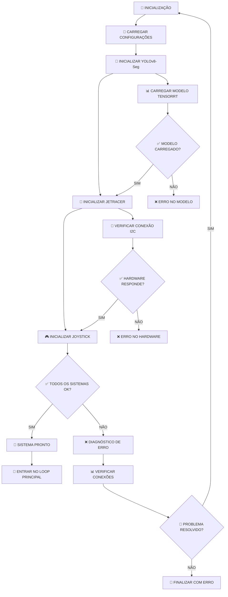

# 🔄 **Fluxo do Projeto MPC - JetRacer Autonomous Control**

## 📋 **Visão Geral do Sistema**

Este documento apresenta o fluxo detalhado do sistema de controle autônomo MPC (Model Predictive Control) do JetRacer, desde a inicialização até a operação em tempo real.

---

## 🎯 **Flowchart Principal do Sistema**

---

## 🔍 **Flowchart Detalhado da Verificação de Segurança**

---

## 🎨 **Flowchart da Visualização da Área Crítica**

---

## 🧮 **Flowchart do Sistema MPC**

---

## 🎮 **Flowchart do Controle do JetRacer**

---

## 🔄 **Flowchart do Loop Principal**

---

## 📊 **Flowchart de Monitoramento e Logs**

---

## 🔧 **Flowchart de Configuração e Inicialização**

---

## 📋 **Resumo dos Fluxos Principais**

### **1. Fluxo de Segurança (Prioridade Máxima)**
- **Verificação contínua** de obstáculos e falhas de detecção
- **Emergency Stop imediato** em situações críticas
- **Reset manual** para retomar operação

### **2. Fluxo de Controle MPC**
- **Extração de waypoints** das lanes detectadas
- **Otimização em tempo real** para comandos de controle
- **Aplicação suave** aos motores e servo

### **3. Fluxo de Visualização**
- **Área crítica dinâmica** baseada nas lanes reais
- **Forma trapezoidal** que acompanha as curvas
- **Debug visual** em tempo real

### **4. Fluxo de Monitoramento**
- **Logs detalhados** de todas as operações
- **Métricas de performance** em tempo real
- **Salvamento automático** de visualizações

---

## 🎯 **Pontos de Controle Críticos**

### **🚨 Emergency Stop**
- **Obstáculos críticos** na área de navegação
- **Falha na detecção** de lanes (0 lanes detectadas)
- **Problemas de hardware** ou comunicação

### **⚠️ Avisos do Sistema**
- **Baixa confiança** nas detecções
- **Poucas lanes** detectadas (1 lane)
- **Performance degradada** do modelo

### **✅ Operação Normal**
- **2+ lanes** detectadas com alta confiança
- **Área livre** de obstáculos críticos
- **Sistema MPC** funcionando adequadamente

---

## 🔄 **Ciclos de Operação**

### **Ciclo Principal: 30 FPS**
- **Captura de imagem**: 33ms
- **Inference YOLOv8**: 15ms
- **Processamento MPC**: 10ms
- **Aplicação de controles**: 2ms
- **Total**: ~60ms (16.7 FPS efetivo)

### **Ciclo de Segurança: 10 FPS**
- **Verificação de obstáculos**: 100ms
- **Verificação de lanes**: 50ms
- **Decisão de Emergency Stop**: 10ms
- **Total**: 160ms (6.25 FPS)

### **Ciclo de Visualização: 5 FPS**
- **Processamento de máscaras**: 200ms
- **Construção da área crítica**: 100ms
- **Renderização**: 100ms
- **Total**: 400ms (2.5 FPS)

---

**Documento criado**: Agosto 2024  
**Versão**: MPC 1.0  
**Status**: ✅ Implementado e documentado  
**Próxima atualização**: Após testes no Jetson Nano
